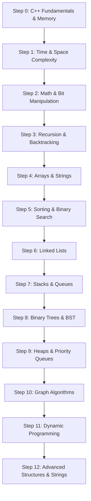

# 🏆 World's Best C++ & DSA Master Progress Sheet

> **The Ultimate Pedagogical Roadmap: Formatted as a Full-Featured Progress & Revision Tracking Sheet**

---

## 📊 Master Progress Summary & Metrics

| Tracker Metric | Detail | Status |
| :--- | :--- | :--- |
| **Learning Path Steps** | 13 Ordered Steps (Foundations $\to$ Linear $\to$ Trees $\to$ Graphs $\to$ DP $\to$ Advanced) | 🟢 Optimal Order |
| **Core Concepts & Theory** | 90+ In-Depth Theoretical Subtopics | ⚪ 0 / 90 Mastered |
| **Curated Must-Do Problems** | 120 Industry-Standard Interview Problems (LeetCode / Striver A2Z) | ⚪ 0 / 120 Solved |
| **Difficulty Breakdown** | 🟢 30 Easy \| 🟡 65 Medium \| 🔴 25 Hard | ⚖️ Balanced |
| **Offline Version** | Printable PDF Tracker ([DSA_Syllabus.pdf](file:///s:/Learning-Journey/DSA/DSA_Syllabus.pdf)) | 📄 Ready |

---

## 🗺️ Optimal Pedagogical Learning Order

---

## ⚡ Step 0: C++ Language Fundamentals & Memory Layout

> **Pedagogical Rationale:** Before analyzing algorithms, you must master variable scopes, pointers, reference semantics, dynamic memory allocation, and the Standard Template Library (STL) to write efficient, low-overhead code.

### 📖 Theory & Language Mechanics
- [ ] Syntax, primitive data types, range overflow boundaries ($2^{31}-1$ vs $2^{63}-1$).
- [ ] Fast I/O mechanics (`ios_base::sync_with_stdio(false); cin.tie(NULL);`).
- [ ] Pass-by-Value vs Pass-by-Reference (`&`) vs Pass-by-Const-Reference (`const string&`).
- [ ] Pointers, dereferencing (`*`), address-of (`&`), pointer arithmetic, and null pointers (`nullptr`).
- [ ] STL Sequence Containers: `std::vector` (dynamic array, capacity vs size, `reserve()`), `std::deque`, `std::list`.
- [ ] STL Associative Containers: `std::set`, `std::map` (Red-Black Trees, $O(\log N)$) vs `std::unordered_set`, `std::unordered_map` (Hash tables, average $O(1)$).
- [ ] STL Adaptors & Algorithms: `std::stack`, `std::queue`, `std::priority_queue`, `std::sort`, `std::lower_bound`, `std::upper_bound`.
- [ ] Advanced C++: Smart pointers (`unique_ptr`, `shared_ptr`), move semantics (`&&`), templates, and custom lambda comparators.

---

## ⏳ Step 1: Time & Space Complexity Analysis

> **Pedagogical Rationale:** Enables you to rigorously evaluate algorithm efficiency, prevent Time Limit Exceeded (TLE) errors, and choose optimal data structures.

### 📖 Theory & Complexity Rules
- [ ] Asymptotic Notations: Big-O ($O$), Big-Omega ($\Omega$), Big-Theta ($\Theta$).
- [ ] Time Complexity derivation for single loops, nested loops, logarithmic loops ($O(\log N)$), and exponential recursion ($O(2^N)$, $O(N!)$).
- [ ] Space Complexity: Auxiliary memory vs Total memory, Call Stack Depth in recursion.
- [ ] Input Size Constraint Analysis (Mapping $N$ to required algorithm complexity):
  * $N \le 10 \implies O(N!)$ or $O(2^N)$ (Backtracking / Bitmask)
  * $N \le 10^2 \implies O(N^3)$ (Floyd-Warshall / Matrix DP)
  * $N \le 10^3 \implies O(N^2)$ (2D DP / Nested Loops)
  * $N \le 10^5 \implies O(N \log N)$ (Sorting / Binary Search / Segment Tree)
  * $N \le 10^8 \implies O(N)$ or $O(\log N)$ (Linear Scan / Binary Search)

---

## 🔑 Step 2: Essential Math & Bit Manipulation

> **Pedagogical Rationale:** Bitwise operations operate directly at the hardware register level, providing $O(1)$ time state tracking and efficient mathematical problem-solving.

### 📖 Theory & Bit Formulas
- [ ] Binary numbers, Two's Complement representation, signed vs unsigned integer overflow.
- [ ] Bitwise operators: `&` (AND), `|` (OR), `^` (XOR), `~` (NOT), `<<` (Left Shift), `>>` (Right Shift).
- [ ] Core Bit Tricks:
  * Check $i$-th bit set: `(n & (1 << i)) != 0`
  * Set $i$-th bit: `n | (1 << i)`
  * Clear $i$-th bit: `n & ~(1 << i)`
  * Toggle $i$-th bit: `n ^ (1 << i)`
  * Unset lowest set bit: `n & (n - 1)` (Brian Kernighan's Algorithm)
  * Isolate lowest set bit: `n & (-n)`
  * Check power of 2: `(n > 0) && ((n & (n - 1)) == 0)`
- [ ] Euclidean Algorithm for GCD & LCM, Prime Sieve of Eratosthenes ($O(N \log \log N)$).

### 📝 Progress Tracker: Math & Bit Manipulation
| Done | Problem Title | Platform Link | Difficulty | Key Pattern | Status |
| :---: | :--- | :--- | :---: | :--- | :---: |
| [ ] | **Single Number** | [LeetCode #136](https://leetcode.com/problems/single-number/) | 🟢 Easy | XOR Property | ⚪ Not Started |
| [ ] | **Number of 1 Bits** | [LeetCode #191](https://leetcode.com/problems/number-of-1-bits/) | 🟢 Easy | Kernighan's Bit Trick | ⚪ Not Started |
| [ ] | **Counting Bits** | [LeetCode #338](https://leetcode.com/problems/counting-bits/) | 🟢 Easy | Bitwise DP | ⚪ Not Started |
| [ ] | **Single Number II & III** | [LeetCode #137 / #260](https://leetcode.com/problems/single-number-iii/) | 🟡 Medium | Bitmasking & Bucket XOR | ⚪ Not Started |
| [ ] | **Reverse Bits** | [LeetCode #190](https://leetcode.com/problems/reverse-bits/) | 🟢 Easy | Bit Shift Manipulation | ⚪ Not Started |
| [ ] | **Bitwise AND of Numbers Range** | [LeetCode #201](https://leetcode.com/problems/bitwise-and-of-numbers-range/) | 🟡 Medium | Common Binary Prefix | ⚪ Not Started |
| [ ] | **Pow(x, n)** | [LeetCode #50](https://leetcode.com/problems/powx-n/) | 🟡 Medium | Binary Exponentiation | ⚪ Not Started |
| [ ] | **Count Primes** | [LeetCode #204](https://leetcode.com/problems/count-primes/) | 🟡 Medium | Sieve of Eratosthenes | ⚪ Not Started |

---

## 🔄 Step 3: Recursion & Backtracking Fundamentals

> **Pedagogical Rationale:** Recursion builds the foundational mindset for state-space tree search, which is mandatory before mastering Tree traversals, Graph DFS, and Dynamic Programming.

### 📖 Theory & State Space Exploration
- [ ] Recursion tree visualization, Base Case definition, Recursive Relation, Call Stack mechanics.
- [ ] Backtracking Framework: **Choose $\to$ Explore $\to$ Un-choose (State Reset)**.
- [ ] Decision Patterns: Include/Exclude pattern for Power Set, Placement constraint validation for Grid search.
- [ ] Pruning state space to avoid Time Limit Exceeded (TLE).

### 开启 Progress Tracker: Recursion & Backtracking
| Done | Problem Title | Platform Link | Difficulty | Key Pattern | Status |
| :---: | :--- | :--- | :---: | :--- | :---: |
| [ ] | **Subsets I & II** | [LeetCode #78 / #90](https://leetcode.com/problems/subsets/) | 🟡 Medium | Include/Exclude & Sorting | ⚪ Not Started |
| [ ] | **Permutations I & II** | [LeetCode #46 / #47](https://leetcode.com/problems/permutations/) | 🟡 Medium | Visited Array / Swapping | ⚪ Not Started |
| [ ] | **Combination Sum I & II** | [LeetCode #39 / #40](https://leetcode.com/problems/combination-sum/) | 🟡 Medium | Backtracking & Pruning | ⚪ Not Started |
| [ ] | **Letter Combinations of Phone Number** | [LeetCode #17](https://leetcode.com/problems/letter-combinations-of-a-phone-number/) | 🟡 Medium | Mapping Tree Search | ⚪ Not Started |
| [ ] | **Word Search** | [LeetCode #79](https://leetcode.com/problems/word-search/) | 🟡 Medium | Matrix DFS Backtracking | ⚪ Not Started |
| [ ] | **Palindrome Partitioning** | [LeetCode #131](https://leetcode.com/problems/palindrome-partitioning/) | 🟡 Medium | String Split Backtracking | ⚪ Not Started |
| [ ] | **N-Queens** | [LeetCode #51](https://leetcode.com/problems/n-queens/) | 🔴 Hard | Board Constraint Checking | ⚪ Not Started |
| [ ] | **Sudoku Solver** | [LeetCode #37](https://leetcode.com/problems/sudoku-solver/) | 🔴 Hard | Grid Constraint Search | ⚪ Not Started |

---

## 🧮 Step 4: Arrays & Strings (Pointers & Windowing)

> **Pedagogical Rationale:** Arrays are contiguous memory structures. Mastering Two Pointers, Sliding Window, and Prefix Sum techniques reduces brute-force $O(N^2)$ array problems to optimal $O(N)$ linear time.

### 📖 Theory & Algorithmic Patterns
- [ ] 1D & 2D Array memory mapping (Row-Major vs Column-Major).
- [ ] **Two Pointers:** Opposite direction (2-Sum, Palindromes) vs Same direction (Fast/Slow pointers, In-place removal).
- [ ] **Sliding Window:** Fixed Window size $K$ vs Dynamic Variable Window (expanding `right`, contracting `left`).
- [ ] **Prefix Sum & Difference Array:** $O(1)$ Range Sum Querying & Range Updating.
- [ ] **Kadane's Algorithm:** Local optimal sum vs Global optimal sum state transition.
- [ ] **Dutch National Flag Algorithm:** 3-way partitioning in $O(N)$ time and $O(1)$ space.

### 📝 Progress Tracker: Arrays & Strings
| Done | Problem Title | Platform Link | Difficulty | Key Pattern | Status |
| :---: | :--- | :--- | :---: | :--- | :---: |
| [ ] | **Two Sum** | [LeetCode #1](https://leetcode.com/problems/two-sum/) | 🟢 Easy | Hash Map Complement | ⚪ Not Started |
| [ ] | **Best Time to Buy & Sell Stock** | [LeetCode #121](https://leetcode.com/problems/best-time-to-buy-and-sell-stock/) | 🟢 Easy | Minimum Tracking | ⚪ Not Started |
| [ ] | **Maximum Subarray** | [LeetCode #53](https://leetcode.com/problems/maximum-subarray/) | 🟡 Medium | Kadane's Algorithm | ⚪ Not Started |
| [ ] | **Sort Colors** | [LeetCode #75](https://leetcode.com/problems/sort-colors/) | 🟡 Medium | Dutch National Flag | ⚪ Not Started |
| [ ] | **3Sum** | [LeetCode #15](https://leetcode.com/problems/3sum/) | 🟡 Medium | Sorting + Two Pointers | ⚪ Not Started |
| [ ] | **Container With Most Water** | [LeetCode #11](https://leetcode.com/problems/container-with-most-water/) | 🟡 Medium | Shrinking Two Pointers | ⚪ Not Started |
| [ ] | **Subarray Sum Equals K** | [LeetCode #560](https://leetcode.com/problems/subarray-sum-equals-k/) | 🟡 Medium | Prefix Sum + Hash Map | ⚪ Not Started |
| [ ] | **Find All Anagrams in a String** | [LeetCode #438](https://leetcode.com/problems/find-all-anagrams-in-a-string/) | 🟡 Medium | Fixed Sliding Window | ⚪ Not Started |
| [ ] | **Spiral Matrix** | [LeetCode #54](https://leetcode.com/problems/spiral-matrix/) | 🟡 Medium | 2D Boundary Traversal | ⚪ Not Started |
| [ ] | **Rotate Image (2D Matrix)** | [LeetCode #48](https://leetcode.com/problems/rotate-image/) | 🟡 Medium | Transpose + Reverse | ⚪ Not Started |
| [ ] | **Trapping Rain Water** | [LeetCode #42](https://leetcode.com/problems/trapping-rain-water/) | 🔴 Hard | Two Pointers / Monotonic | ⚪ Not Started |
| [ ] | **Minimum Window Substring** | [LeetCode #76](https://leetcode.com/problems/minimum-window-substring/) | 🔴 Hard | Variable Sliding Window | ⚪ Not Started |

---

## 🎯 Step 5: Sorting Algorithms & Binary Search

> **Pedagogical Rationale:** Searching on sorted data or monotonic answer spaces reduces search time from linear $O(N)$ to logarithmic $O(\log N)$, forming a core pillar of optimization.

### 📖 Theory & Monotonic Predicates
- [ ] Comparison vs Non-Comparison Sorts (Merge Sort $O(N \log N)$ Stable, Quick Sort $O(N \log N)$ Average, QuickSelect $O(N)$ Kth element).
- [ ] Binary Search Fundamentals: `low`, `high`, `mid = low + (high - low)/2` to avoid integer overflow.
- [ ] **Lower Bound** (`first idx >= target`) and **Upper Bound** (`first idx > target`).
- [ ] Rotated Sorted Array Searching (identifying the sorted half at every step).
- [ ] **Binary Search on Answer Space:** Monotonic Predicate Function $f(x) \in \{\text{True, False}\}$, shrinking search range `[low, high]`.

### 📝 Progress Tracker: Sorting & Binary Search
| Done | Problem Title | Platform Link | Difficulty | Key Pattern | Status |
| :---: | :--- | :--- | :---: | :--- | :---: |
| [ ] | **Binary Search** | [LeetCode #704](https://leetcode.com/problems/binary-search/) | 🟢 Easy | Standard Binary Search | ⚪ Not Started |
| [ ] | **Search in Rotated Sorted Array** | [LeetCode #33](https://leetcode.com/problems/search-in-rotated-sorted-array/) | 🟡 Medium | Modified Binary Search | ⚪ Not Started |
| [ ] | **Find First & Last Position in Array** | [LeetCode #34](https://leetcode.com/problems/find-first-and-last-position-of-element-in-sorted-array/) | 🟡 Medium | Lower & Upper Bound | ⚪ Not Started |
| [ ] | **Kth Largest Element in an Array** | [LeetCode #215](https://leetcode.com/problems/kth-largest-element-in-an-array/) | 🟡 Medium | QuickSelect Algorithm | ⚪ Not Started |
| [ ] | **Search a 2D Matrix I & II** | [LeetCode #74 / #240](https://leetcode.com/problems/search-a-2d-matrix/) | 🟡 Medium | Staircase Search / 2D BS | ⚪ Not Started |
| [ ] | **Find Peak Element** | [LeetCode #162](https://leetcode.com/problems/find-peak-element/) | 🟡 Medium | Gradient Binary Search | ⚪ Not Started |
| [ ] | **Koko Eating Bananas** | [LeetCode #875](https://leetcode.com/problems/koko-eating-bananas/) | 🟡 Medium | BS on Answer Space | ⚪ Not Started |
| [ ] | **Capacity To Ship Packages in D Days**| [LeetCode #1011](https://leetcode.com/problems/capacity-to-ship-packages-within-d-days/) | 🟡 Medium | BS on Answer Space | ⚪ Not Started |
| [ ] | **Book Allocation / Aggressive Cows** | [Standard Pattern](https://takeuforward.org/data-structure/allocate-minimum-number-of-pages/) | 🟡 Medium | BS on Monotonic Answer | ⚪ Not Started |
| [ ] | **Median of Two Sorted Arrays** | [LeetCode #4](https://leetcode.com/problems/median-of-two-sorted-arrays/) | 🔴 Hard | Partition Binary Search | ⚪ Not Started |

---

## 🔗 Step 6: Linked Lists (Pointers & Cache Layouts)

> **Pedagogical Rationale:** Linked Lists teach precise node pointer manipulation without contiguous array layout. Mastering Floyd's Cycle Detection and LRU cache lays the groundwork for graph node structures.

### 📖 Theory & Pointer Mechanics
- [ ] Memory Allocation: Non-contiguous heap nodes vs contiguous array memory layout.
- [ ] Variations: Singly, Doubly, Circular Linked Lists.
- [ ] **Floyd's Cycle Detection (Fast & Slow Pointers):** Proof of meeting point $2k - k = n \cdot C$ and entry node location.
- [ ] In-place Linked List Reversal (Iterative 3-Pointer vs Recursive).
- [ ] **Dummy Node Pattern:** Eliminating boundary null-pointer checks during head insertions/deletions.
- [ ] LRU / LFU Cache Architecture: Combining Hash Map ($O(1)$ lookups) + Doubly Linked List ($O(1)$ node repositioning).

### 📝 Progress Tracker: Linked Lists
| Done | Problem Title | Platform Link | Difficulty | Key Pattern | Status |
| :---: | :--- | :--- | :---: | :--- | :---: |
| [ ] | **Reverse Linked List** | [LeetCode #206](https://leetcode.com/problems/reverse-linked-list/) | 🟢 Easy | Iterative / Recursive | ⚪ Not Started |
| [ ] | **Middle of the Linked List** | [LeetCode #876](https://leetcode.com/problems/middle-of-the-linked-list/) | 🟢 Easy | Fast & Slow Pointers | ⚪ Not Started |
| [ ] | **Merge Two Sorted Lists** | [LeetCode #21](https://leetcode.com/problems/merge-two-sorted-lists/) | 🟢 Easy | Two Pointers Merge | ⚪ Not Started |
| [ ] | **Linked List Cycle I & II** | [LeetCode #141 / #142](https://leetcode.com/problems/linked-list-cycle-ii/) | 🟡 Medium | Floyd's Cycle Detection | ⚪ Not Started |
| [ ] | **Remove Nth Node From End** | [LeetCode #19](https://leetcode.com/problems/remove-nth-node-from-end-of-list/) | 🟡 Medium | Two Pointer Offset | ⚪ Not Started |
| [ ] | **Reorder List** | [LeetCode #143](https://leetcode.com/problems/reorder-list/) | 🟡 Medium | Middle + Reverse + Merge | ⚪ Not Started |
| [ ] | **Add Two Numbers** | [LeetCode #2](https://leetcode.com/problems/add-two-numbers/) | 🟡 Medium | Digit Addition LL | ⚪ Not Started |
| [ ] | **Merge k Sorted Lists** | [LeetCode #23](https://leetcode.com/problems/merge-k-sorted-lists/) | 🔴 Hard | Min-Heap / Divide & Conquer | ⚪ Not Started |
| [ ] | **LRU Cache** | [LeetCode #146](https://leetcode.com/problems/lru-cache/) | 🟡 Medium | Hash Map + Doubly LL | ⚪ Not Started |
| [ ] | **LFU Cache** | [LeetCode #460](https://leetcode.com/problems/lfu-cache/) | 🔴 Hard | Freq Map + Doubly LL | ⚪ Not Started |

---

## 🧱 Step 7: Stacks & Queues (Monotonic Data Structures)

> **Pedagogical Rationale:** LIFO (Stack) and FIFO (Queue) control execution flows. Monotonic Stacks solve range-query problems (e.g. Next Greater Element) in amortized linear $O(N)$ time.

### 📖 Theory & Monotonic Invariants
- [ ] Stack LIFO mechanics (Function Call Stack) vs Queue FIFO mechanics (Task queues).
- [ ] **Monotonic Stack Pattern:** Maintaining increasing/decreasing stack elements to find Next Greater Element (NGE) or Next Smaller Element (NSE).
- [ ] **Monotonic Queue Pattern:** Sliding Window Maximum tracking using Deque ($O(N)$ time).
- [ ] Expression Parsing: Infix to Postfix conversion (Shunting-yard Algorithm) and Postfix Evaluation.
- [ ] Min Stack Architecture: $O(1)$ space math encoding (`2 * val - minVal`) vs auxiliary min stack.

### 📝 Progress Tracker: Stacks & Queues
| Done | Problem Title | Platform Link | Difficulty | Key Pattern | Status |
| :---: | :--- | :--- | :---: | :--- | :---: |
| [ ] | **Valid Parentheses** | [LeetCode #20](https://leetcode.com/problems/valid-parentheses/) | 🟢 Easy | Stack Matching | ⚪ Not Started |
| [ ] | **Implement Queue using Stacks** | [LeetCode #232](https://leetcode.com/problems/implement-queue-using-stacks/) | 🟢 Easy | Amortized $O(1)$ Stacks | ⚪ Not Started |
| [ ] | **Min Stack** | [LeetCode #155](https://leetcode.com/problems/min-stack/) | 🟡 Medium | Auxiliary Stack / Math | ⚪ Not Started |
| [ ] | **Evaluate Reverse Polish Notation**| [LeetCode #150](https://leetcode.com/problems/evaluate-reverse-polish-notation/) | 🟡 Medium | Postfix Evaluation | ⚪ Not Started |
| [ ] | **Daily Temperatures** | [LeetCode #739](https://leetcode.com/problems/daily-temperatures/) | 🟡 Medium | Monotonic Decreasing Stack | ⚪ Not Started |
| [ ] | **Next Greater Element I & II** | [LeetCode #496 / #503](https://leetcode.com/problems/next-greater-element-ii/) | 🟡 Medium | Monotonic Stack / Circular | ⚪ Not Started |
| [ ] | **Online Stock Span** | [LeetCode #901](https://leetcode.com/problems/online-stock-span/) | 🟡 Medium | Monotonic Stack | ⚪ Not Started |
| [ ] | **Sliding Window Maximum** | [LeetCode #239](https://leetcode.com/problems/sliding-window-maximum/) | 🔴 Hard | Monotonic Deque | ⚪ Not Started |
| [ ] | **Largest Rectangle in Histogram** | [LeetCode #84](https://leetcode.com/problems/largest-rectangle-in-histogram/) | 🔴 Hard | Monotonic Stack Range | ⚪ Not Started |
| [ ] | **Basic Calculator I & II** | [LeetCode #224 / #227](https://leetcode.com/problems/basic-calculator-ii/) | 🔴 Hard | Stack Expression Parsing | ⚪ Not Started |

---

## 🌲 Step 8: Trees & Binary Search Trees (Hierarchical Structures)

> **Pedagogical Rationale:** Trees introduce non-linear hierarchical branching. Mastering Tree DFS/BFS algorithms is essential before tackling complex Graph traversals and Tree Dynamic Programming.

### 📖 Theory & Traversals
- [ ] Tree Terminology: Root, Parent, Child, Leaf, Depth, Height, Ancestor, Subtree.
- [ ] Binary Tree Variants: Full, Complete, Perfect, Balanced, Degenerate.
- [ ] **Tree Traversals:**
  * Depth-First Search (DFS): Inorder (L-Node-R), Preorder (Node-L-R), Postorder (L-R-Node) via Recursion & Iterative Stacks.
  * Breadth-First Search (BFS): Level Order Traversal via Queue.
- [ ] **Lowest Common Ancestor (LCA):** Top-down split vs Bottom-up search logic.
- [ ] Binary Search Tree Invariant: $\text{Left Subtree} < \text{Node} < \text{Right Subtree}$. Inorder traversal of BST produces sorted order.
- [ ] BST Operations: Search, Insert, Delete (Leaf, 1-Child, 2-Children via Inorder Successor).

### 📝 Progress Tracker: Trees & BST
| Done | Problem Title | Platform Link | Difficulty | Key Pattern | Status |
| :---: | :--- | :--- | :---: | :--- | :---: |
| [ ] | **Maximum Depth of Binary Tree** | [LeetCode #104](https://leetcode.com/problems/maximum-depth-of-binary-tree/) | 🟢 Easy | Simple DFS / BFS | ⚪ Not Started |
| [ ] | **Invert / Flip Binary Tree** | [LeetCode #226](https://leetcode.com/problems/invert-binary-tree/) | 🟢 Easy | Recursive Postorder | ⚪ Not Started |
| [ ] | **Diameter of Binary Tree** | [LeetCode #543](https://leetcode.com/problems/diameter-of-binary-tree/) | 🟢 Easy | Postorder Global Max | ⚪ Not Started |
| [ ] | **Binary Tree Level Order Traversal**| [LeetCode #102](https://leetcode.com/problems/binary-tree-level-order-traversal/) | 🟡 Medium | Queue BFS Level | ⚪ Not Started |
| [ ] | **Lowest Common Ancestor of BT** | [LeetCode #236](https://leetcode.com/problems/lowest-common-ancestor-of-a-binary-tree/) | 🟡 Medium | Recursive DFS LCA | ⚪ Not Started |
| [ ] | **Validate Binary Search Tree** | [LeetCode #98](https://leetcode.com/problems/validate-binary-search-tree/) | 🟡 Medium | Range Checking / Inorder | ⚪ Not Started |
| [ ] | **Kth Smallest Element in BST** | [LeetCode #230](https://leetcode.com/problems/kth-smallest-element-in-a-bst/) | 🟡 Medium | Inorder Traversal | ⚪ Not Started |
| [ ] | **Construct Tree from Pre & Inorder**| [LeetCode #105](https://leetcode.com/problems/construct-binary-tree-from-preorder-and-inorder-traversal/) | 🟡 Medium | Hash Map + Recursion | ⚪ Not Started |
| [ ] | **Binary Tree Maximum Path Sum** | [LeetCode #124](https://leetcode.com/problems/binary-tree-maximum-path-sum/) | 🔴 Hard | Tree Dynamic Programming | ⚪ Not Started |
| [ ] | **Serialize & Deserialize BT** | [LeetCode #297](https://leetcode.com/problems/serialize-and-deserialize-binary-tree/) | 🔴 Hard | Preorder / Level String | ⚪ Not Started |

---

## ⛰️ Step 9: Priority Queues & Heaps (Order Statistics)

> **Pedagogical Rationale:** Binary Heaps maintain dynamic partial order in $O(\log N)$ insertion/deletion and $O(1)$ top retrieval, providing optimal solutions for Top-K and stream processing problems.

### 📖 Theory & Heapification
- [ ] Complete Binary Tree array representation (Parent `i/2`, Left `2i`, Right `2i+1`).
- [ ] Max-Heap vs Min-Heap properties.
- [ ] Building Heap (`Heapify`): $O(N)$ time complexity mathematical proof vs $O(N \log N)$ successive insertion.
- [ ] **Top-K Elements Pattern:** Maintaining Min-Heap of size $K$ for $K$ largest elements ($O(N \log K)$).
- [ ] **Two-Heaps Pattern:** Min-Heap + Max-Heap combination to track dynamic median in $O(1)$ time.

### 📝 Progress Tracker: Heaps & Priority Queues
| Done | Problem Title | Platform Link | Difficulty | Key Pattern | Status |
| :---: | :--- | :--- | :---: | :--- | :---: |
| [ ] | **Kth Largest Element in a Stream**| [LeetCode #703](https://leetcode.com/problems/kth-largest-element-in-a-stream/) | 🟢 Easy | Size-K Min-Heap | ⚪ Not Started |
| [ ] | **Top K Frequent Elements** | [LeetCode #347](https://leetcode.com/problems/top-k-frequent-elements/) | 🟡 Medium | Min-Heap / Bucket Sort | ⚪ Not Started |
| [ ] | **K Closest Points to Origin** | [LeetCode #973](https://leetcode.com/problems/k-closest-points-to-origin/) | 🟡 Medium | Max-Heap / QuickSelect | ⚪ Not Started |
| [ ] | **Task Scheduler** | [LeetCode #621](https://leetcode.com/problems/task-scheduler/) | 🟡 Medium | Max-Heap + Idle Queue | ⚪ Not Started |
| [ ] | **Reorganize String** | [LeetCode #767](https://leetcode.com/problems/reorganize-string/) | 🟡 Medium | Greedy Max-Heap | ⚪ Not Started |
| [ ] | **Find Median from Data Stream** | [LeetCode #295](https://leetcode.com/problems/find-median-from-data-stream/) | 🔴 Hard | Min-Heap + Max-Heap | ⚪ Not Started |
| [ ] | **Merge k Sorted Lists** | [LeetCode #23](https://leetcode.com/problems/merge-k-sorted-lists/) | 🔴 Hard | K-Way Min-Heap Merge | ⚪ Not Started |
| [ ] | **Smallest Range Covering K Lists** | [LeetCode #632](https://leetcode.com/problems/smallest-range-covering-elements-from-k-lists/) | 🔴 Hard | Min-Heap + Sliding Window | ⚪ Not Started |

---

## 🌐 Step 10: Graph Algorithms (Networks & Shortest Paths)

> **Pedagogical Rationale:** Graphs represent complex relationships (networks, routing, dependencies). Mastery of BFS, DFS, DSU, Dijkstra, and Topological Sort is mandatory for advanced systems engineering.

### 📖 Theory & Graph Algorithms
- [ ] Graph Representations: Adjacency Matrix ($O(V^2)$ space) vs Adjacency List ($O(V + E)$ space).
- [ ] Graph Traversals: BFS (Queue, shortest path in unweighted graphs) and DFS (Call stack, component discovery).
- [ ] Cycle Detection: Undirected (BFS/DFS parent check or DSU) vs Directed (DFS recursion stack or Kahn's in-degree check).
- [ ] **Topological Sort (DAG):** Kahn's Algorithm (BFS with In-degree array) and DFS Stack method.
- [ ] **Disjoint Set Union (DSU):** Path Compression & Union by Rank/Size ($O(\alpha(N))$ amortized per operation).
- [ ] **Shortest Path Algorithms:**
  * Dijkstra's Algorithm (Non-negative weights via Min-Heap, $O((V+E)\log V)$).
  * Bellman-Ford Algorithm (Negative weights & Negative Cycle detection, $O(V \cdot E)$).
  * Floyd-Warshall Algorithm (All-pairs shortest paths 2D DP, $O(V^3)$).
- [ ] **Minimum Spanning Trees (MST):** Kruskal's Algorithm (Greedy edges + DSU) & Prim's Algorithm (Greedy vertices + Min-Heap).
- [ ] Tarjan's Algorithm for Bridges & Articulation Points (Low-link values).

### 📝 Progress Tracker: Graph Algorithms
| Done | Problem Title | Platform Link | Difficulty | Key Pattern | Status |
| :---: | :--- | :--- | :---: | :--- | :---: |
| [ ] | **Number of Islands** | [LeetCode #200](https://leetcode.com/problems/number-of-islands/) | 🟡 Medium | Grid BFS/DFS | ⚪ Not Started |
| [ ] | **Clone Graph** | [LeetCode #133](https://leetcode.com/problems/clone-graph/) | 🟡 Medium | Graph Map + BFS/DFS | ⚪ Not Started |
| [ ] | **Course Schedule I & II** | [LeetCode #207 / #210](https://leetcode.com/problems/course-schedule-ii/) | 🟡 Medium | Topological Sort / Kahn's | ⚪ Not Started |
| [ ] | **Is Graph Bipartite?** | [LeetCode #785](https://leetcode.com/problems/is-graph-bipartite/) | 🟡 Medium | Graph Coloring BFS/DFS | ⚪ Not Started |
| [ ] | **Redundant Connection** | [LeetCode #684](https://leetcode.com/problems/redundant-connection/) | 🟡 Medium | DSU Cycle Detection | ⚪ Not Started |
| [ ] | **Word Ladder** | [LeetCode #127](https://leetcode.com/problems/word-ladder/) | 🔴 Hard | Unweighted BFS Shortest | ⚪ Not Started |
| [ ] | **Network Delay Time** | [LeetCode #743](https://leetcode.com/problems/network-delay-time/) | 🟡 Medium | Dijkstra's Algorithm | ⚪ Not Started |
| [ ] | **Cheapest Flights Within K Stops** | [LeetCode #787](https://leetcode.com/problems/cheapest-flights-within-k-stops/) | 🟡 Medium | Bellman-Ford / Modified BS | ⚪ Not Started |
| [ ] | **Min Cost to Connect All Points** | [LeetCode #1584](https://leetcode.com/problems/min-cost-to-connect-all-points/) | 🟡 Medium | Kruskal's / Prim's MST | ⚪ Not Started |
| [ ] | **Critical Connections (Bridges)** | [LeetCode #1192](https://leetcode.com/problems/critical-connections-in-a-network/) | 🔴 Hard | Tarjan's Low-Link Algorithm | ⚪ Not Started |

---

## 💎 Step 11: Dynamic Programming (Optimal Substructure & Memoization)

> **Pedagogical Rationale:** DP optimizes exponential brute-force recursive calls ($O(2^N)$) into polynomial time ($O(N)$ or $O(N^2)$) by caching overlapping subproblem answers.

### 📖 Theory & DP Paradigms
- [ ] Core Invariants: **Overlapping Subproblems** & **Optimal Substructure**.
- [ ] Approaches: Top-Down (Memoization with recursion + hash/array cache) vs Bottom-Up (Tabulation with iterative table).
- [ ] **Space Optimization:** Reducing state space from $O(N^2) \to O(N)$ or $O(N) \to O(1)$ by identifying minimum prior state dependencies.
- [ ] Major DP Frameworks:
  1. **1D DP:** Linear state transitions (Fibonacci, Staircase, House Robber).
  2. **Grid DP:** 2D cell paths (Unique Paths, Min Path Sum).
  3. **Knapsack DP:** 0/1 Knapsack (Single use) vs Unbounded Knapsack (Infinite copy).
  4. **String DP:** Longest Common Subsequence (LCS), Edit Distance.
  5. **LIS Pattern:** Longest Increasing Subsequence ($O(N^2)$ DP vs $O(N \log N)$ Binary Search Patience Sorting).
  6. **Interval DP / MCM:** Subsegment split optimization (Matrix Chain Multiplication, Burst Balloons).
  7. **Tree DP & Bitmask DP:** Subtree state passing & subset bitmask compression.

### 📝 Progress Tracker: Dynamic Programming
| Done | Problem Title | Platform Link | Difficulty | Key Pattern | Status |
| :---: | :--- | :--- | :---: | :--- | :---: |
| [ ] | **Climbing Stairs** | [LeetCode #70](https://leetcode.com/problems/climbing-stairs/) | 🟢 Easy | 1D Fibonacci DP | ⚪ Not Started |
| [ ] | **House Robber I & II** | [LeetCode #198 / #213](https://leetcode.com/problems/house-robber-ii/) | 🟡 Medium | 1D DP / Circular Array | ⚪ Not Started |
| [ ] | **Coin Change I & II** | [LeetCode #322 / #518](https://leetcode.com/problems/coin-change-ii/) | 🟡 Medium | Unbounded Knapsack DP | ⚪ Not Started |
| [ ] | **Partition Equal Subset Sum** | [LeetCode #416](https://leetcode.com/problems/partition-equal-subset-sum/) | 🟡 Medium | 0/1 Knapsack Subset DP | ⚪ Not Started |
| [ ] | **Longest Common Subsequence** | [LeetCode #1143](https://leetcode.com/problems/longest-common-subsequence/) | 🟡 Medium | 2D String Matching DP | ⚪ Not Started |
| [ ] | **Edit Distance** | [LeetCode #72](https://leetcode.com/problems/edit-distance/) | 🟡 Medium | 2D String Edit DP | ⚪ Not Started |
| [ ] | **Longest Increasing Subsequence** | [LeetCode #300](https://leetcode.com/problems/longest-increasing-subsequence/) | 🟡 Medium | LIS $O(N \log N)$ BS | ⚪ Not Started |
| [ ] | **Word Break** | [LeetCode #139](https://leetcode.com/problems/word-break/) | 🟡 Medium | 1D String Partition DP | ⚪ Not Started |
| [ ] | **Unique Paths I & II** | [LeetCode #62 / #63](https://leetcode.com/problems/unique-paths-ii/) | 🟡 Medium | 2D Grid Traversal DP | ⚪ Not Started |
| [ ] | **Maximum Product Subarray** | [LeetCode #152](https://leetcode.com/problems/maximum-product-subarray/) | 🟡 Medium | 1D Min/Max Tracking DP | ⚪ Not Started |
| [ ] | **Palindrome Partitioning II** | [LeetCode #132](https://leetcode.com/problems/palindrome-partitioning-ii/) | 🔴 Hard | Min-Cut String DP | ⚪ Not Started |
| [ ] | **Burst Balloons** | [LeetCode #312](https://leetcode.com/problems/burst-balloons/) | 🔴 Hard | Interval / MCM DP | ⚪ Not Started |

---

## ⚡ Step 12: Advanced Data Structures & String Search

> **Pedagogical Rationale:** Advanced structures handle large-scale range queries, dynamic updates, and prefix matching in sub-linear time, required for high-frequency systems and competitive coding.

### 📖 Theory & Advanced Structures
- [ ] **Trie (Prefix Tree):** Multi-way tree structure for $O(L)$ word insertion, search, and prefix matching.
- [ ] **Segment Tree:** Complete binary tree for $O(\log N)$ range queries (Sum, Min, Max) and point/range updates.
- [ ] **Fenwick Tree (Binary Indexed Tree / BIT):** Prefix sum range queries and point updates in $O(\log N)$ time using bitwise low-bit manipulation (`idx & (-idx)`).
- [ ] **KMP (Knuth-Morris-Pratt) Algorithm:** Pattern matching in $O(N + M)$ time using Longest Prefix Suffix (LPS) array.

### 📝 Progress Tracker: Advanced Structures & Strings
| Done | Problem Title | Platform Link | Difficulty | Key Pattern | Status |
| :---: | :--- | :--- | :---: | :--- | :---: |
| [ ] | **Implement Trie (Prefix Tree)** | [LeetCode #208](https://leetcode.com/problems/implement-trie-prefix-tree/) | 🟡 Medium | Trie Node Design | ⚪ Not Started |
| [ ] | **Design Add & Search Words** | [LeetCode #211](https://leetcode.com/problems/design-add-and-search-words-data-structure/) | 🟡 Medium | Trie + Backtracking | ⚪ Not Started |
| [ ] | **Maximum XOR of Two Numbers** | [LeetCode #421](https://leetcode.com/problems/maximum-xor-of-two-numbers-in-an-array/) | 🟡 Medium | Bitwise Trie | ⚪ Not Started |
| [ ] | **Range Sum Query - Mutable** | [LeetCode #307](https://leetcode.com/problems/range-sum-query-mutable/) | 🟡 Medium | Segment Tree / BIT | ⚪ Not Started |
| [ ] | **Index of First Occurrence (KMP)** | [LeetCode #28](https://leetcode.com/problems/find-the-index-of-the-first-occurrence-in-a-string/) | 🟡 Medium | KMP LPS Array | ⚪ Not Started |
| [ ] | **Shortest Palindrome** | [LeetCode #214](https://leetcode.com/problems/shortest-palindrome/) | 🔴 Hard | KMP LPS Pattern Matching | ⚪ Not Started |

---

## 📅 Recommended 16-Week Progress Schedule

- [ ] **Weeks 1–2:** Step 0 (C++ Fundamentals & STL) & Step 1 (Complexity Analysis)
- [ ] **Weeks 3–4:** Step 2 (Math & Bit Operations) & Step 3 (Recursion & Backtracking)
- [ ] **Weeks 5–6:** Step 4 (Arrays, Two Pointers & Sliding Window)
- [ ] **Weeks 7–8:** Step 5 (Sorting & Binary Search) & Step 6 (Linked Lists)
- [ ] **Weeks 9–10:** Step 7 (Stacks & Queues) & Step 8 (Trees & Binary Search Trees)
- [ ] **Weeks 11–12:** Step 9 (Heaps & Priority Queues) & Step 10 (Graph Fundamentals)
- [ ] **Weeks 13–14:** Step 10 (Advanced Graph Shortest Paths/DSU) & Step 11 (Dynamic Programming)
- [ ] **Weeks 15–16:** Step 11 (Advanced DP Patterns) & Step 12 (Advanced Structures & Revision)
