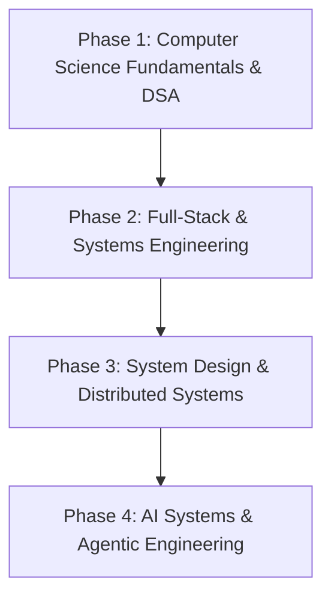

# 🗺️ Software Engineering Learning Roadmap

This document outlines the structured learning milestones and technical progression roadmap across core software engineering domains.

---

## 📍 Phases & Milestones

---

## 1. 🧮 Data Structures & Algorithms
- [ ] **Core Data Structures:** Arrays, Strings, Linked Lists, Stacks, Queues, Hash Tables
- [ ] **Advanced Trees & Graphs:** Binary Trees, BST, Heaps, Graph Traversals (BFS/DFS), Topological Sort, Disjoint Set
- [ ] **Algorithmic Patterns:** Two Pointers, Sliding Window, Fast/Slow Pointers, Monotonic Stack, Backtracking
- [ ] **Dynamic Programming:** 1D DP, 2D DP, DP on Trees, DP on Graphs
- [ ] **Problem Solving Goal:** 300+ Curated Problems (LeetCode / Codeforces)

---

## 2. 🏗️ System Design & Architecture
- [ ] **Low Level Design (LLD):** Object-Oriented Design Principles (SOLID), Design Patterns, UML Diagrams
- [ ] **High Level Design (HLD):** Client-Server Architecture, Load Balancing, Caching, Message Queues, Rate Limiting
- [ ] **Databases & Storage:** Relational (PostgreSQL), NoSQL (MongoDB, Cassandra), Key-Value (Redis), Sharding & Indexing
- [ ] **Distributed Systems:** CAP Theorem, Distributed Consensus, Event-Driven Architecture

---

## 3. 🤖 Artificial Intelligence & Machine Learning
- [ ] **Foundations:** Linear Algebra, Calculus, Probability, Python Data Stack (NumPy, Pandas, PyTorch)
- [ ] **Classical Machine Learning:** Regression, Classification, Clustering, Model Evaluation
- [ ] **Deep Learning & NLP:** Neural Networks, Transformers, Attention Mechanisms
- [ ] **Generative AI & Agents:** LLM Fine-tuning, RAG Architecture, Agentic AI Workflows (LangChain, AutoGen, CrewAI)

---

## 4. 🌐 Full-Stack & DevOps Engineering
- [ ] **Backend Services:** Microservices Architecture, RESTful APIs, gRPC, Authentication & Security
- [ ] **Frontend Architecture:** Modern UI Frameworks, Component Design Systems, Performance Optimization
- [ ] **DevOps & Cloud:** Docker, Kubernetes, GitHub Actions (CI/CD), AWS Infrastructure
